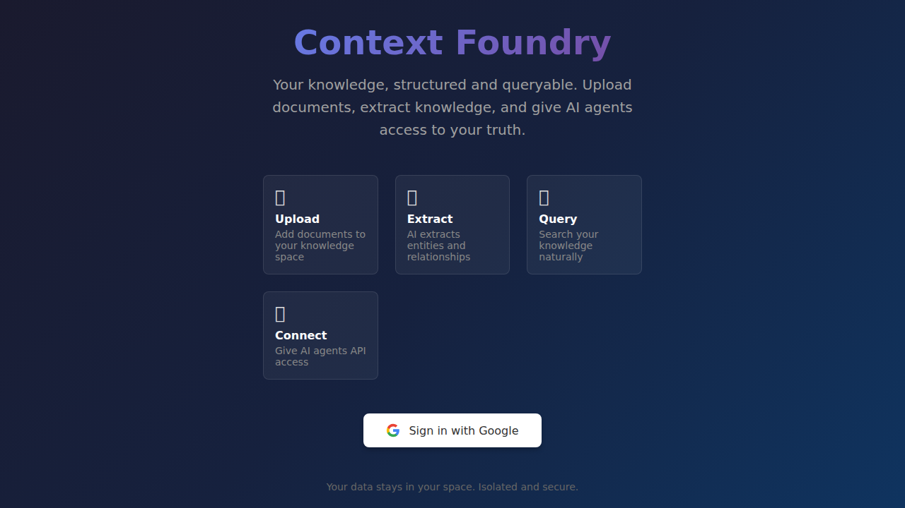
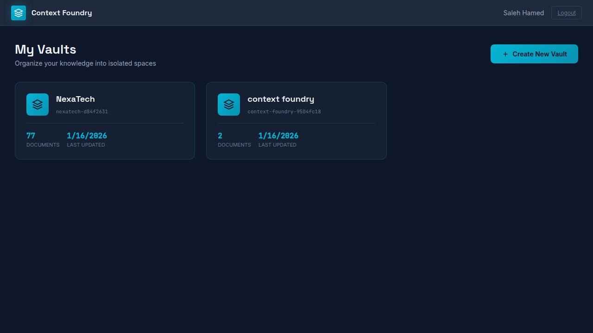
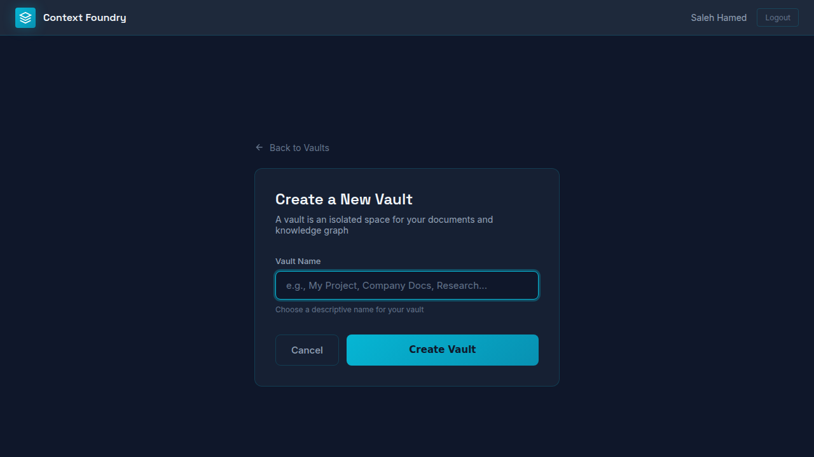
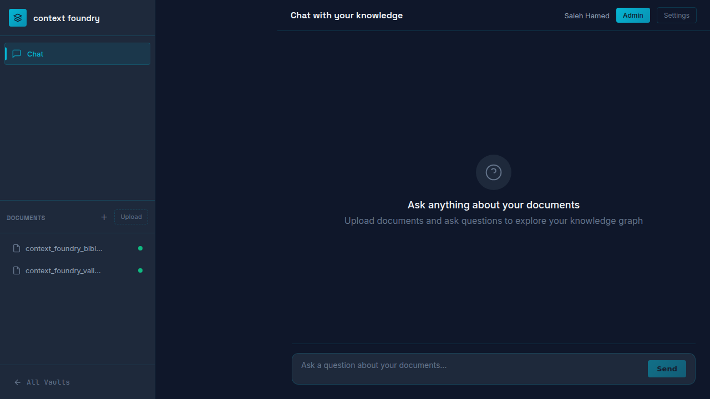
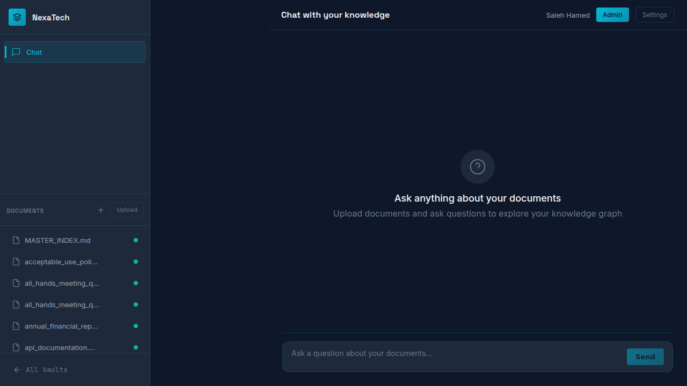
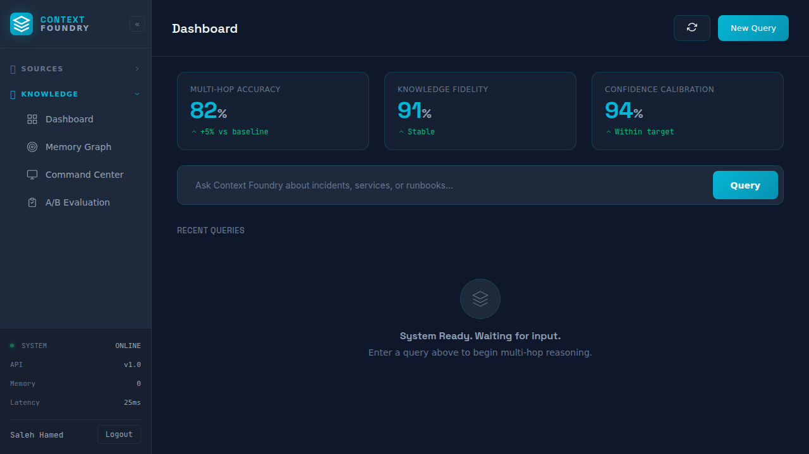
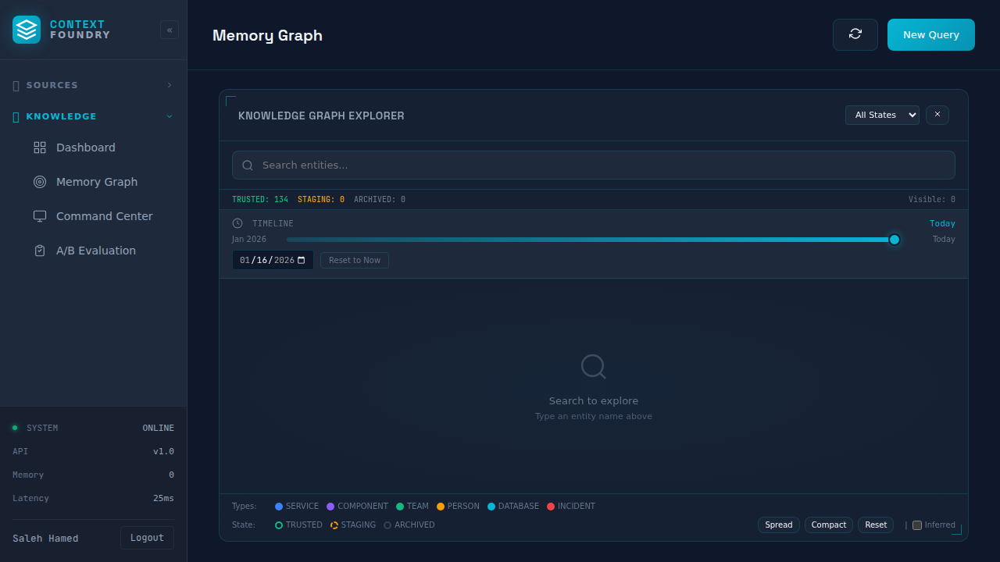
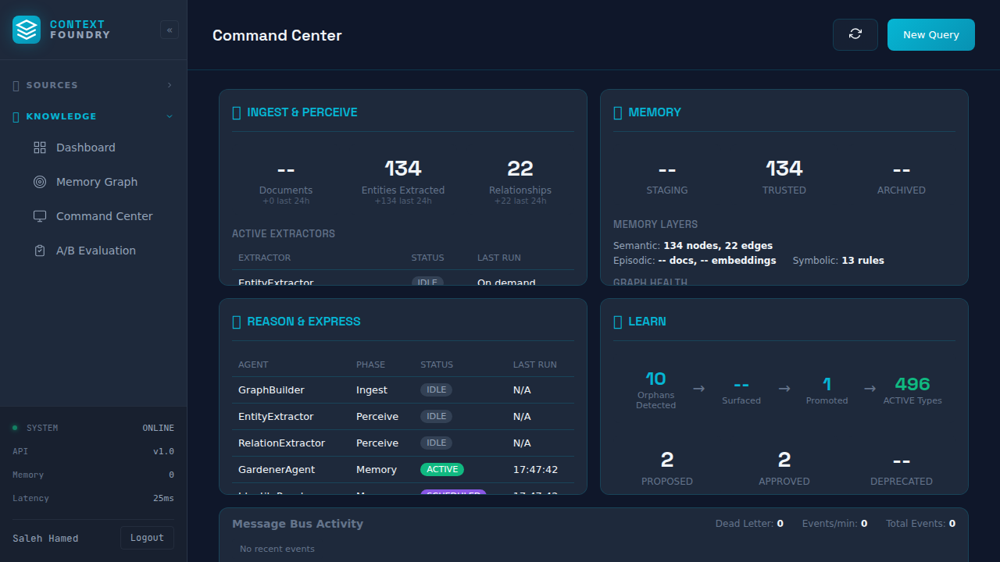
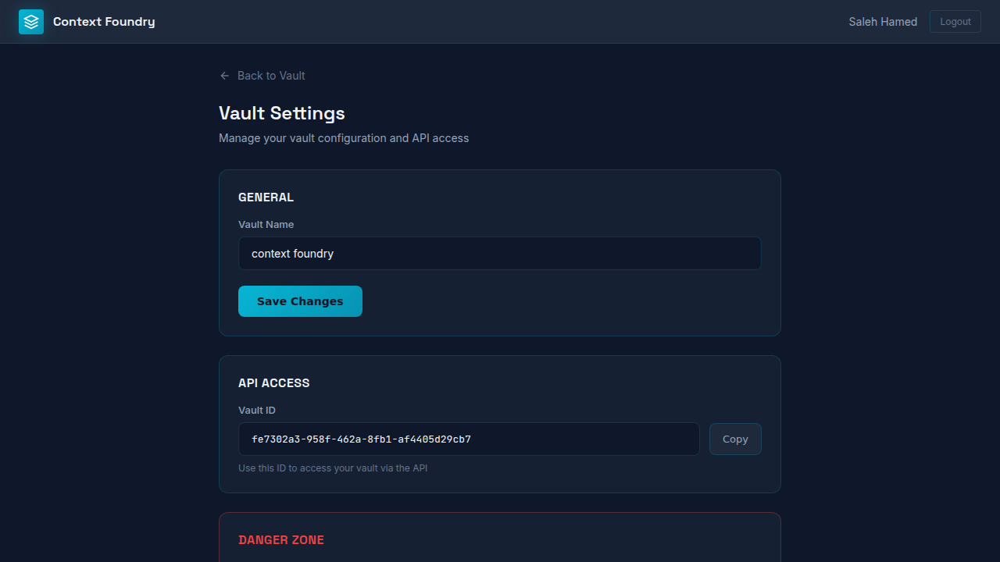

# Context Foundry
## Complete Product Guide & User Manual

---

# Part 1: Product Overview

## What is Context Foundry?

Context Foundry is a **Cognitive Operating System for the Enterprise** that transforms your documents into a living, queryable knowledge graph. Instead of searching through files and reading manually, you ask questions in natural language and receive answers backed by confidence scores and source citations.

The system uses AI to automatically extract entities (people, organizations, products, concepts) and relationships from your documents, building an interconnected knowledge graph that grows smarter over time.

## The Problem We Solve

| Traditional Document Management | The Context Foundry Approach |
|--------------------------------|------------------------------|
| Documents sit in folders, unconnected | Documents become interconnected knowledge |
| Search returns files, not answers | Ask questions, get direct answers |
| AI chatbots hallucinate freely | Every answer includes confidence score and source citations |
| Knowledge trapped in individual files | Relationships span across all documents |
| No way to verify AI claims | Full provenance trail to original text |
| Static snapshots of information | Living knowledge that evolves over time |

## Who Is Context Foundry For?

### Primary Users

**Knowledge Workers**
- Researchers cross-referencing multiple sources
- Analysts synthesizing information from many documents
- Legal professionals reviewing case files and precedents
- Medical professionals accessing patient histories and protocols

**Teams & Organizations**
- Companies building institutional knowledge bases
- Consulting firms managing client intelligence
- Research teams coordinating across projects
- Compliance teams tracking policies and regulations

### Use Cases

| Industry | Use Case |
|----------|----------|
| **Healthcare** | Query patient protocols, drug interactions, treatment guidelines |
| **Legal** | Cross-reference case law, contracts, regulatory requirements |
| **Finance** | Synthesize research reports, compliance documents, market intelligence |
| **Technology** | Query technical documentation, incident reports, system architectures |
| **Research** | Cross-reference academic papers, synthesize findings |

## Core Value Proposition

### 1. Trustworthy AI Answers
Every response includes a **confidence score** (0-100%) so you know how reliable the answer is, plus **source citations** linking back to the original documents.

### 2. Connected Knowledge
The system automatically discovers relationships between entities across all your documents. A person mentioned in one document is connected to their role in another, their projects in a third.

### 3. Living Knowledge
Unlike static databases, Context Foundry's knowledge graph evolves. New documents automatically integrate. Outdated information gets archived. The system learns and improves.

### 4. Enterprise-Grade Architecture
- **Multi-tenant isolation**: Each vault is completely separate
- **Tri-memory system**: Semantic (what), Episodic (when), Symbolic (rules)
- **Fact lifecycle**: Staging → Trusted → Archived
- **Full audit trail**: Every fact traced to its source

---

# Part 2: System Architecture

## The Tri-Memory System

Context Foundry organizes knowledge across three memory types:

### Semantic Memory (The Knowledge Graph)
**What things are and how they relate**
- Entities: People, Organizations, Products, Services, Concepts
- Relationships: WORKS_FOR, REPORTS_TO, OWNS, MANAGES, etc.
- Properties: Names, titles, dates, values

### Episodic Memory (The Timeline)
**When things happened**
- Events and incidents with timestamps
- Changes over time
- Historical context for entities

### Symbolic Memory (The Rules)
**Constraints and policies**
- Business rules and constraints
- Validation rules
- User preferences and corrections

## The Fact Lifecycle

Every piece of knowledge follows a lifecycle:

```
STAGING → TRUSTED → ARCHIVED
```

| Stage | Description |
|-------|-------------|
| **Staging** | Newly extracted, awaiting validation |
| **Trusted** | Validated and used for reasoning |
| **Archived** | Superseded or stale, preserved for history |

## AI Agents

| Agent | Role |
|-------|------|
| **GraphBuilder** | Extracts entities and relationships from documents |
| **EntityExtractor** | Identifies and classifies entities |
| **RelationExtractor** | Discovers relationships between entities |
| **GardenerAgent** | Maintains quality (deduplication, promotion, pruning) |
| **QueryPipeline** | Processes natural language questions |
| **ValidationAgent** | Applies rules and adjusts confidence |

---

# Part 3: Screenshots & Interface Guide

## Screen 1: Landing Page

**URL:** `/`



**Purpose:** Entry point for new users. Sign in with Google to access your vaults.

**Key Elements:**
- Google OAuth sign-in button
- Four-pillar value proposition: Upload, Extract, Query, Connect
- Clean, professional dark theme

---

## Screen 2: My Vaults (Dashboard)

**URL:** `/app`



**Purpose:** Central hub showing all your knowledge vaults.

**Key Elements:**
- **Vault cards**: Each card shows vault name, ID, document count, last updated
- **Create New Vault button**: Top right, cyan accent
- **User info**: Name and logout in header

**What a Vault Is:**
A vault is an isolated knowledge space. Documents and their extracted knowledge are completely separate between vaults. Use different vaults for:
- Different clients or projects
- Different departments
- Different topics or research areas

---

## Screen 3: Create New Vault

**URL:** `/app/new`



**Purpose:** Create a new isolated knowledge space.

**Instructions:**
1. Enter a descriptive name (e.g., "Q1 Research", "Client ABC", "HR Policies")
2. Click "Create Vault"
3. You'll be taken to your new empty vault

---

## Screen 4: Vault Chat View (Small Vault)

**URL:** `/app/{vault_id}`



**Purpose:** Main workspace where you upload documents and ask questions.

**Layout:**
- **Left Sidebar:**
  - Chat tab (active)
  - Documents list with status indicators
  - Upload button (+)
  - Back to All Vaults link
  
- **Main Area:**
  - Chat interface
  - Question input at bottom
  - Responses appear with confidence scores and sources

**Document Status Indicators:**
- Green dot = Extraction complete, ready for queries
- Yellow dot = Extraction in progress
- Red dot = Extraction failed

---

## Screen 5: Vault Chat View (Large Vault)

**URL:** `/app/{vault_id}`



**Purpose:** Shows a vault with many documents, demonstrating scalability.

**Features Visible:**
- Scrollable document list
- Multiple document types
- All documents show extraction complete (green dots)

---

## Screen 6: Admin Dashboard

**URL:** `/app/{vault_id}/dashboard`



**Purpose:** High-level overview of knowledge graph health and activity.

**Metrics:**
| Metric | Description |
|--------|-------------|
| Multi-hop Accuracy | How well the system answers complex, multi-step questions |
| Knowledge Fidelity | Accuracy of extracted facts compared to source documents |
| Confidence Calibration | How well confidence scores predict actual correctness |

**System Status Panel (Bottom Left):**
- System status (Online/Offline)
- API version
- Memory usage
- Query latency

---

## Screen 7: Memory Graph Explorer

**URL:** `/app/{vault_id}/memory-graph`



**Purpose:** Visually explore the knowledge graph.

**Features:**

1. **Search Bar:** Find any entity by name

2. **Entity Counts:**
   - TRUSTED: Validated facts (green) - shows 134 in this example
   - STAGING: New extractions awaiting validation (yellow)
   - ARCHIVED: Old/superseded facts (gray)

3. **Timeline Slider:** See knowledge at any point in time
   - Drag slider to historical date
   - "Reset to Now" returns to current state

4. **Type Filters:**
   - SERVICE: Software services and applications
   - COMPONENT: System components
   - TEAM: Teams and departments
   - PERSON: Individual people
   - DATABASE: Data stores
   - INCIDENT: Events and incidents

5. **State Filters:**
   - TRUSTED: Only show validated facts
   - STAGING: Only show pending facts
   - ARCHIVED: Show historical facts

6. **View Controls:**
   - Spread: Expand graph layout
   - Compact: Tighten graph layout
   - Reset: Return to default view
   - Inferred: Show/hide inferred relationships

---

## Screen 8: Command Center

**URL:** `/app/{vault_id}/command-center`



**Purpose:** Monitor system health and all extraction/reasoning activity.

**Panels:**

| Panel | What It Shows |
|-------|---------------|
| **Ingest & Perceive** | Documents processed, entities extracted (134), relationships found (22) |
| **Memory** | Facts by lifecycle stage (134 Trusted) |
| **Memory Layers** | Counts per memory type (Semantic: 134 nodes, 22 edges; Symbolic: 13 rules) |
| **Reason & Express** | Agent status (GraphBuilder, EntityExtractor, RelationExtractor, GardenerAgent) |
| **Learn** | Orphan detection (10), surfaced, promoted (1); Active types (496) |
| **Message Bus** | Event activity in the system |

**Agent Status Values:**
- **IDLE:** Agent is ready but not currently processing
- **ACTIVE:** Agent is currently working (GardenerAgent shown as ACTIVE)
- **ERROR:** Agent encountered a problem

---

## Screen 9: Vault Settings

**URL:** `/app/{vault_id}/settings`



**Purpose:** Configure vault settings and access API credentials.

**Sections:**

1. **General:** Rename your vault
2. **API Access:** Get your Vault ID for programmatic access (with Copy button)
3. **Danger Zone:** Permanently delete the vault (requires confirmation)

---

# Part 4: Step-by-Step Walkthroughs

## Walkthrough 1: Getting Started

### Step 1: Sign In
1. Navigate to Context Foundry
2. Click "Sign in with Google"
3. Authorize the application
4. You'll be redirected to My Vaults

### Step 2: Create Your First Vault
1. Click "+ Create New Vault"
2. Enter a name: "My First Knowledge Base"
3. Click "Create Vault"
4. You now have an empty vault ready for documents

### Step 3: Upload Documents
1. In your vault, click the "+" button or "Upload" in the documents panel
2. Drag-and-drop files or browse to select
3. Supported formats: PDF, DOCX, TXT, MD, images
4. Watch the status indicator turn green when extraction completes

### Step 4: Ask Your First Question
1. Type a question in the chat input: "What is this document about?"
2. Click Send or press Enter
3. Receive an answer with confidence score and sources

---

## Walkthrough 2: Building a Company Knowledge Base

### Scenario
You want to create a queryable knowledge base from your company's HR policies, org charts, and procedures.

### Steps

1. **Create a dedicated vault**
   - Name: "HR & Company Policies"

2. **Upload core documents**
   - Employee handbook (PDF)
   - Org chart (PDF or image)
   - Benefits summary (DOCX)
   - PTO policy (PDF)
   - Onboarding checklist (DOCX)

3. **Wait for extraction**
   - Watch status indicators turn green
   - This may take 1-5 minutes depending on document size

4. **Ask organizational questions**
   - "Who reports to the CEO?"
   - "What is our PTO policy?"
   - "How do I submit an expense report?"
   - "What are the health insurance options?"

5. **Explore the knowledge graph**
   - Go to Admin → Memory Graph
   - Search for "CEO" to see connections
   - Filter by PERSON to see all people extracted

---

## Walkthrough 3: Research Cross-Referencing

### Scenario
You're researching a topic across multiple academic papers and need to synthesize findings.

### Steps

1. **Create a research vault**
   - Name: "Climate Change Research 2024"

2. **Upload research papers**
   - Multiple PDFs from different sources
   - Include papers with different perspectives

3. **Ask synthesis questions**
   - "What do these papers say about sea level rise?"
   - "Which studies show conflicting findings?"
   - "Who are the most cited researchers?"
   - "What methodology do most studies use?"

4. **Verify with sources**
   - Check confidence scores
   - Click source citations to verify claims
   - Note which papers support which conclusions

---

## Walkthrough 4: Monitoring System Health

### Steps

1. **Access Command Center**
   - Click Admin → Command Center

2. **Check extraction status**
   - Ingest & Perceive panel shows recent activity
   - Active Extractors shows if agents are working

3. **Monitor memory health**
   - Memory panel shows fact distribution
   - High STAGING count means new facts need review
   - TRUSTED should be your largest category

4. **Review learning activity**
   - Learn panel shows orphan detection
   - Proposed/Approved/Deprecated tracks schema evolution

---

# Part 5: Understanding Confidence Scores

## What Confidence Means

| Score Range | Label | Interpretation |
|-------------|-------|----------------|
| 80-100% | High | Strong evidence from multiple sources; answer is reliable |
| 60-79% | Medium | Good evidence but may have some gaps or single source |
| 40-59% | Low | Limited evidence; answer should be verified |
| 0-39% | Very Low | Minimal evidence; treat with caution |

## Factors That Affect Confidence

| Factor | Impact |
|--------|--------|
| Multiple sources | Increases confidence |
| Recent documents | Higher weight than old documents |
| Direct quotes | Higher than inferred information |
| Explicit relationships | Higher than implicit connections |
| Consistent information | Higher than conflicting data |

## When to Trust Low Confidence Answers

Low confidence doesn't mean wrong. It means:
- The information might be from a single source
- The relationship was inferred rather than explicit
- The documents are older
- There may be conflicting information

**Action:** For low-confidence answers, click the source citations to verify manually.

---

# Part 6: Best Practices

## Document Organization

| Do | Don't |
|----|-------|
| Use separate vaults for separate projects | Mix unrelated documents in one vault |
| Upload clean, text-based documents | Upload scanned images without OCR |
| Include context documents (org charts, glossaries) | Assume the system knows your jargon |
| Use descriptive filenames | Use names like "doc1.pdf" |

## Asking Questions

| Effective Questions | Less Effective Questions |
|--------------------|-------------------------|
| "Who is the CEO of NexaTech?" | "Who's in charge?" |
| "What is the 2024 revenue?" | "How much money?" |
| "What are the quarterly targets for Q1?" | "Targets?" |
| "Who reports to Sarah Chen?" | "Team structure" |

## Maintaining Quality

1. **Review staging facts regularly**
   - Go to Memory Graph
   - Filter by STAGING state
   - Validate or correct as needed

2. **Correct errors when found**
   - System learns from corrections
   - Future extractions improve

3. **Archive outdated information**
   - Upload updated documents
   - Old facts automatically archive

---

# Part 7: Feature Reference

## Document Upload

| Feature | Description |
|---------|-------------|
| **Drag-and-drop** | Drop files directly onto the document panel |
| **Multi-file upload** | Upload many files at once |
| **Supported formats** | PDF, DOCX, TXT, MD, PNG, JPG |
| **Size limit** | 50MB per file |
| **Auto-extraction** | Begins automatically after upload |

## Query Features

| Feature | Description |
|---------|-------------|
| **Natural language** | Ask in plain English |
| **Follow-up questions** | Context maintained in conversation |
| **Role resolution** | "What is the CEO's salary?" auto-resolves CEO to actual person |
| **Multi-hop reasoning** | Answers questions requiring multiple inference steps |

## Knowledge Graph

| Feature | Description |
|---------|-------------|
| **Entity types** | Person, Organization, Service, Component, Team, Database, Incident |
| **Relationship types** | WORKS_FOR, REPORTS_TO, MANAGES, OWNS, HAS_COMPENSATION, etc. |
| **Timeline view** | See knowledge at any historical point |
| **Lifecycle states** | Staging, Trusted, Archived |

## Admin Features

| Feature | Description |
|---------|-------------|
| **Dashboard** | High-level metrics and recent activity |
| **Memory Graph** | Visual knowledge exploration |
| **Command Center** | System monitoring and agent status |
| **Settings** | Vault configuration and API access |

---

# Part 8: Troubleshooting

## Common Issues

| Issue | Solution |
|-------|----------|
| Document shows yellow status | Extraction in progress; wait for completion |
| Document shows red status | Extraction failed; try re-uploading |
| Low confidence answers | Check if documents contain the information |
| "I don't have information about..." | Upload relevant documents |
| Slow extraction | Large documents take longer; be patient |

## Getting Help

1. Check the confidence score and sources
2. Try rephrasing your question
3. Upload additional documents with relevant information
4. Use the Memory Graph to verify entity extraction

---

# Appendix: Keyboard Shortcuts

| Shortcut | Action |
|----------|--------|
| Enter | Send message |
| Ctrl+Enter | New line in message |
| Esc | Close dialogs |

---

*Document Version: 1.0*
*Last Updated: January 2026*
*Context Foundry - Cognitive Operating System for the Enterprise*
